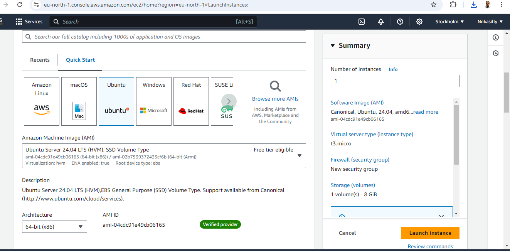
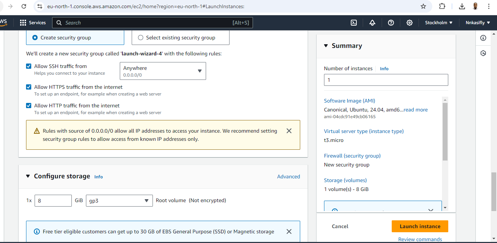
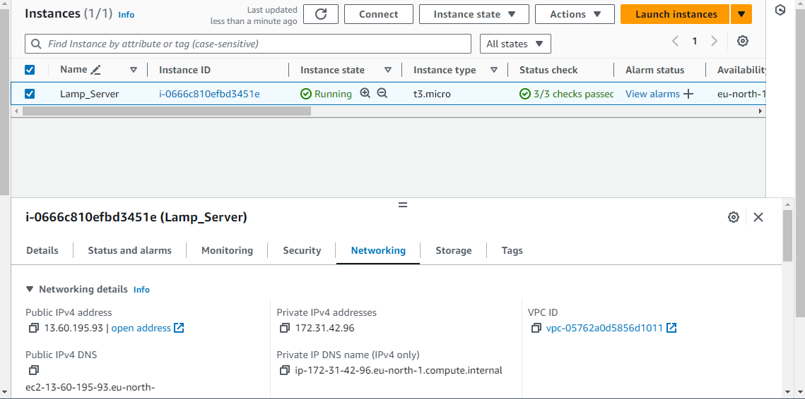
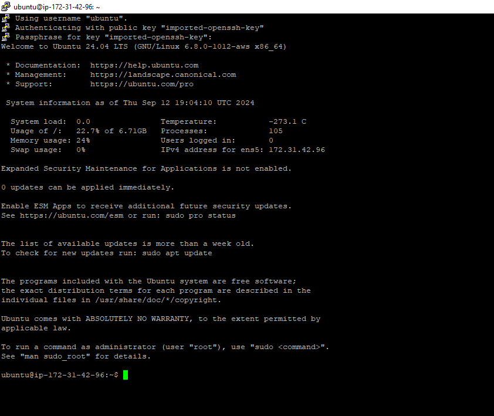
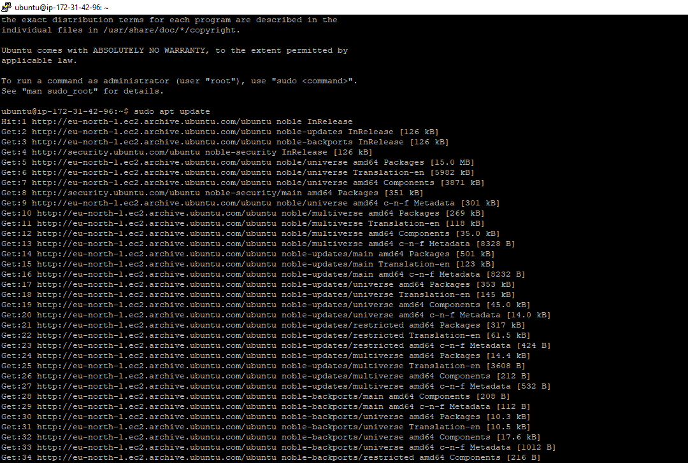

WEB STACK IMPLEMENTATION (LAMP STACK) IN AWS

Introduction:

A “LAMP” stack is a group of open source software that is typically installed together in order to enable a server to host dynamic websites and web apps written in PHP. This term is an acronym which represents the Linux operating system with the Apache web server. The site data is stored in a MySQL database, and dynamic content is processed by PHP. In order to complete this project, we need an AWS account and a server with Ubuntu OS Server.

STEP ONE: Create and EC2 instance on AWS. Using the AWS Management Console, we can set up an ubuntu server in our most preferred region and connect to the EC2 instance using SSH cryptographic key known as PEM(Privacy Enhanced Mail) file.

1_
2_The security group was configured with the following inbound rules:

- Allow traffic on port 80 (HTTP) with source from anywhere on the internet.
- Allow traffic on port 443 (HTTPS) with source from anywhere on the internet.
- Allow traffic on port 22 (SSH) with source from any IP address. This is opened by default.
- 
- 3
- The default VPC and Subnet was used for the networking configuration.
- 
- 4
- The private ssh key that got downloaded was located, permission was changed for the private key file and then used to connect to the instance by running
- chmod 400 "Obiray.pem"
- ssh -i "Obiray.pem" ubuntu@ec2-13-60-195-93.eu-north-1.compute.amazonaws.com
- Where username=ubuntu and public ip address=172.31.42.96 
- 
- Step 1 - Install Apache and Update the Firewall
- 1. Update and upgrade list of packages in package manager
     sudo apt update
     sudo apt upgrade -y
- 
- 
- 

  

